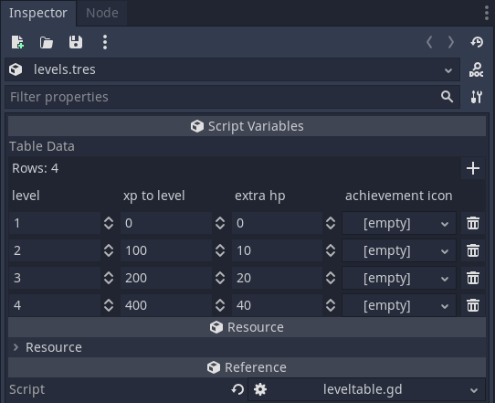

# godot-datatable
Implementation of DataTable-style resources for Godot (written against 3.5.1)

## Usage

Create a custom script for your data table, extending the DataTable class, and override `_get_schema()` to expose your custom table schema:

```GDScript
tool
extends DataTable
class_name LevelTable

func _get_schema():
	return [ SchemaColumn.new("level", TYPE_INT, 1), SchemaColumn.new("xp to level", TYPE_INT, 0), SchemaColumn.new("extra hp", TYPE_INT, 0), SchemaColumn.new("achievement icon", TYPE_OBJECT, null) ];
```

And then simply create a resource of your LevelTable class. The inspector will display a table to which you can add new rows & edit existing rows based on the schema declared above:



Given a reference to your LevelTable resource, you can also use the fluent search API:

```GDScript
var my_table = load("res://example/data/levels.tres") as LevelTable;
var query = my_table.create_search().greater_than("level", 10).not_equal("achievement icon", null);
for i in range(0, query.count()):
  print("XP to level %d: %d" % [ query.get_column_value(i, "level"), query.get_column_value(i, "xp to level") ]);
``` 

## Limitations

- At the moment, the only supported column types for editing are TYPE_INT, TYPE_REAL, TYPE_BOOL, TYPE_STRING, and TYPE_OBJECT.
- Changing column data types or rearranging column order after a table has been created will probably result in losing data. You have been warned!
